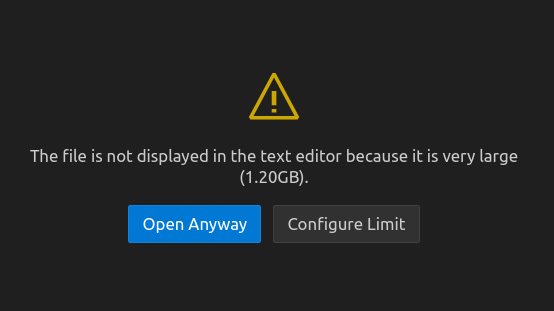
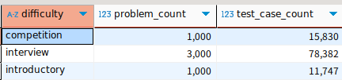
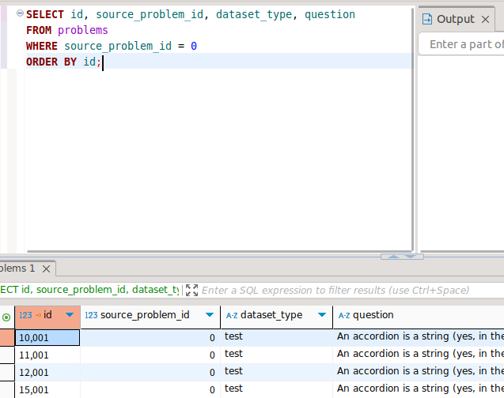

### 데이터셋 요약
https://arxiv.org/pdf/2105.09938
- 해당 논문을 작성한 연구팀에서 데이터셋을 제공하였다.
- 논문에 따라 Dataset을 간략하게 설명하자면 10,000개의 코딩 문제, 해답 검증을 위한 131,777개의 테스트 케이스, 사람이 작성한 232,421개의 정답(ground-truth) 해답을 포함
- 문제는 복잡할 순 있지만 평균 문제 길이는 293.2단어이고, 데이터는 train set과 test set으로 동일하게 나뉨
- 각각 5,000개의 문제가 포함되어 있고, test set의 경우 모든 문제는 다수의 테스트 케이스를 가지며, 평균 test case 수는 21.2개, 각 test case는 해당 문제에 맞게 특별히 설계되어 있어 프로그램 기능을 엄격히 평가할 수 있음.
| test.jsonl, train.jsonl 파일을 열어보니 0~4999개의 인덱스로 정리되어있다.

- 난이도(Difficulty)는 총 3가지로 분류
1. Introductory level: 1-2년 정도의 경험을 가진 프로그래머 수준, 총 3,639개의 문제와 1000개의 test set이 있음
2. Interview level: 더 알고리즘적이고 어려운 문제, 프로그래밍 기술 인터뷰에서 질문하는 수준, 5,000개의 문제와 3000개의 test set이 있음
3. Competition level: 프로그래밍 대회(USACO, IOI, ACM 등)에서 출제되는 수준, 1,361개의 문제와 1000개의 test set이 있음
Total: Problem(5000), TestCase(5000)

- Problem Formats(문제 형식)
| 다양한 문제 출처를 수용하기 위해, APPS의 문제들은 두 가지 형식으로 제공

Call-Based Format
- 보통 초기 시작 코드(starter code) 제공, 주로 함수 헤더 형태로 주어짐 -> 해답은 해당 함수의 반환 값으로 작성

Standard Input Format
- 보통 시작 코드가 주어지지 않음, 문제만 제공 정답을 print 등으로 STDOUT에 출력해야 함

Test Case Quality
- Test sets의 평균 test cases 수는 21.2개
- 일부 문제는 test case가 2개뿐, 주로 Kattis에서 가져옴

test.jsonl: test cases가 작성되어있는 데이터셋
train.jsonl: problems가 작성되어있는 데이터셋

train.jsonl 파일에서 input_output을 보면 개행 표시때문에 엄청나게 난잡한 스트링이 들어가있음
-> JSON으로 변환(Dictionary) -> input_ouput에서 inputs와 outputs 리스트를 순회하며 입/출력 쌍으로 분리 -> 개별 행으로 저장
- test_cases table example 
id   problem_id    inputs        outputs
101     47         blahblah      blahblah
102     47         blahblah      blahblah

### 어떻게 접근할 것인가?
STEP 1. JSON 파일의 요소들을 데이터 프레임으로 만든다.
- jsonl 형식으로 한 라인 당 json 요소가 들어가있음 -> 테이블 형식으로 나누어 보기 편하게 만들 계획
- 데이터프레임으로 만들기 전 결국 파일을 로드해야 함
STEP 2. 파일을 어떻게 로딩할 것인가?
- 메모리에 한 번에 올리는 것은 매우 안 좋은 방식이고 속도도 정말 느려짐
-> Why? 메모리(RAM)의 물리적 한계때문이다.
STEP 3. chunk로 쪼개어 처리하자
- 파일 전체를 메모리에 올리는 대신 파일 포인터를 열어두고 chunksize를 지정하여 chunk 단위로 올리자.
STEP 4. DB 삽입
- 한 줄씩 처리해서 바로 DB에 삽입하면 너무 많은 요청이 가게 됨
- 가공된 데이터를 메모리의 작은 리스트에 쌓는다
- 리스트가 일정 크기에 도달하면 묶음을 한 번에 삽입(Bulk insert)
- 삽입이 끝나면 리스트 비우고 다시 데이터 쌓기(반복)
- train.jsonl 파일에서 input_output을 보면 개행 표시때문에 엄청나게 난잡한 스트링이 들어가있음
-> JSON으로 변환(Dictionary) -> input_ouput에서 inputs와 outputs 리스트를 순회하며 입/출력 쌍으로 분리 -> 개별 행으로 저장
- test_cases table example 
id   problem_id    inputs        outputs
101     47         blahblah      blahblah
102     47         blahblah      blahblah

- test.jsonl file size: 1.2GB

- problem total: 5,000
- test_case_count total: 105959
- script processing result: [script result](result.txt) 

Error:
- Can't reconnect until invalid transaction is rolled back.  Please rollback() fully before proceeding (Background on this error at: https://sqlalche.me/e/20/8s2b)
-> problems 데이터는 삽입이 성공한 상태, test cases를 삽입하던 중 에러가 발생
- 데이터 무결성이 깨져서 생겼음.  
- (Background on this error at: https://sqlalche.me/e/20/f405)
-> postgresql이 처리할 수 있는 파라미터 수를 넘겨버려서 에러가 발생함
- 청크로 나눠서 처리해야할 것 같음 -> 청크로 나눠서 처리했는데도 똑같은 에러 발생
- 한 번에 처리하려 하지 말고 나누어 처리해야할 것 같음

데이터베이스에 삽입은 됐지만 중복되는데 데이터가 발생..
- source_problem_id 0번인게 4개씩 있는 문제.. 나머지 데이터들도 마찬가지 0~4999개의 문제가 아닌 10,000개가 데이터베이스에 기록됨

-> Database 제약조건을 다시 작성했음 problem_id에 unique 값을 적용

궁금했던 점:
1. cat으로 file을 열면 내용이 바로 로딩됨 but 텍스트 편집기에는 로딩이 안 됨
-> cat 명령어는 파일의 내용을 그대로 터미널에 출력만 하는 역할, 텍스트 편집기들은 파일은 편집하기 위해 내용을 분석하고 가공하는 복잡한 과정을 거치기 때문.
-> 